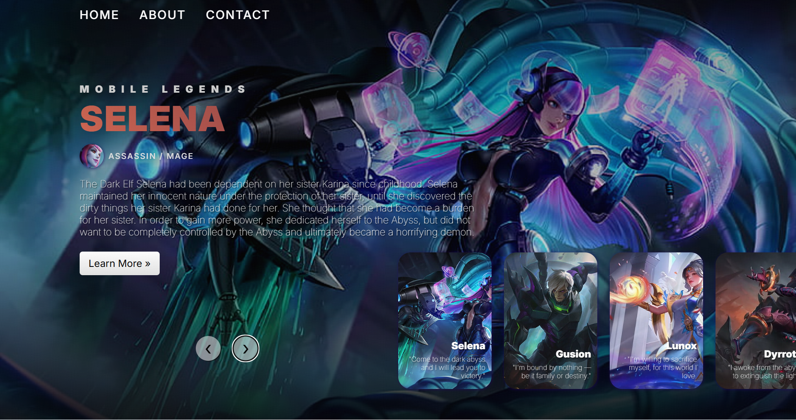

# 🎮 Mobile Legends Image Slider

Sebuah proyek landing page interaktif yang menampilkan koleksi Hero Mobile Legends dengan desain modern, animasi transisi yang halus, dan fitur-fitur premium.

## ✨ Fitur Utama
- **Animated Slider:** Transisi gambar utama yang disinkronkan dengan pergerakan thumbnail.
- **Auto-play:** Slider bergeser secara otomatis setiap 7 detik dengan logika reset saat interaksi manual.
- **Responsive Design:** Tampilan optimal di berbagai perangkat (Desktop, Tablet, dan Smartphone).
- **Interactive Navbar:** Navigasi fungsional (Home, About, Contact) menggunakan sistem Modal/Pop-up.
- **Learn More Modal:** Informasi detail hero yang muncul secara dinamis tanpa berpindah halaman.
- **Glassmorphism UI:** Efek blur pada modal dan elemen navigasi untuk kesan modern.

## 🛠️ Teknologi yang Digunakan
- **HTML5:** Struktur semantik untuk konten.
- **CSS3:** Custom styling, Keyframes Animation, Media Queries, dan Flexbox/Grid.
- **Vanilla JavaScript:** Logika slider, DOM Manipulation, Autoplay, dan Event Handling.

## 📸 Demo Tampilan
[](https://mochamadkhairan.github.io/Website-Slider/)

🔗 **Live Preview:** [Lihat Langsung Di Sini](https://mochamadkhairan.github.io/Website-Slider/)


## 🚀 Cara Menjalankan Secara Lokal
1. Clone repositori ini:
   ```bash
   git clone [https://github.com/mochamadkhairan/Website-Slider.git](https://github.com/mochamadkhairan/Website-Slider.git)
2. Buka folder proyek.
3. Jalankan file index.html di browser favorit Anda.

## Struktur Folder
├── image/          # Aset gambar hero dan icon
├── index.html      # File utama
├── style.css       # Styling lengkap & responsif
├── script.js       # Logika slider & navigasi
├── reset.css       # Reset default browser styling
└── README.md       # Dokumentasi proyek

Dibuat dengan ❤️ oleh Mochamad Khairan Athallah Sunandar

---
